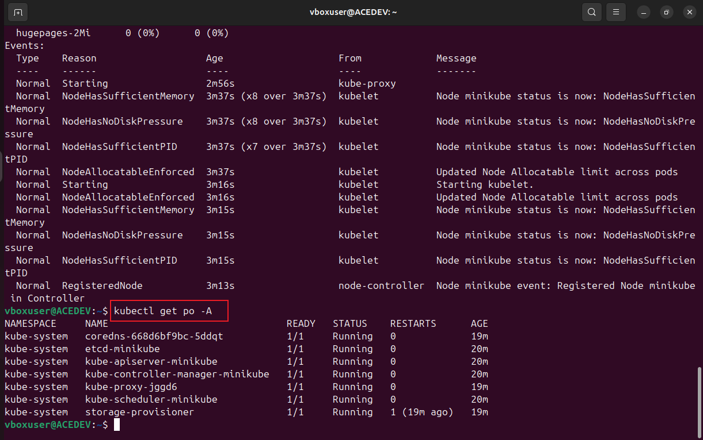
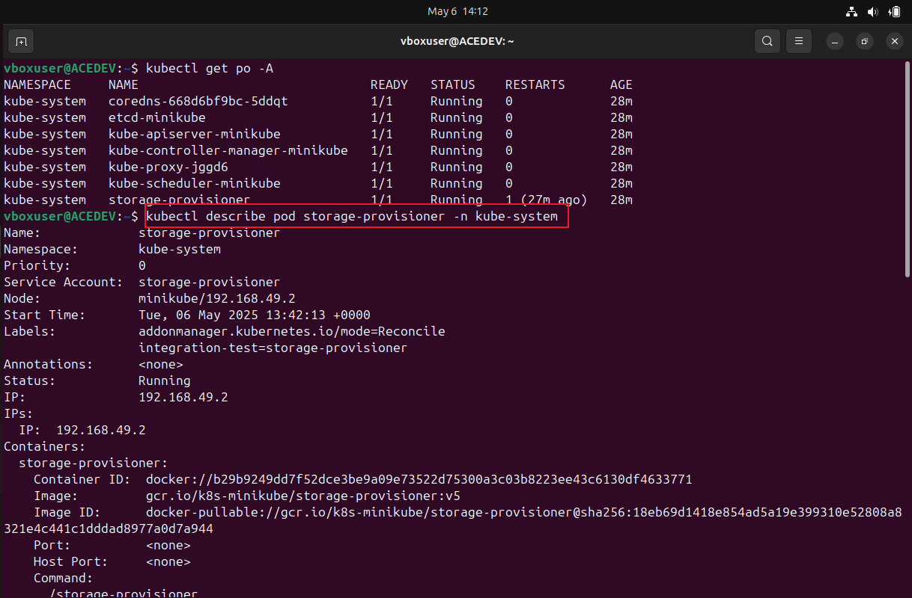
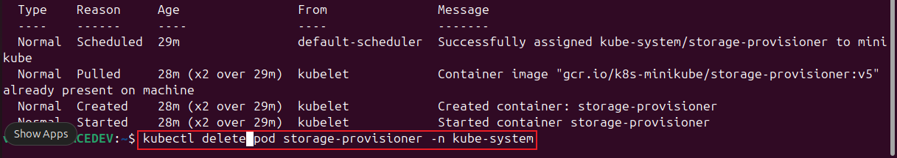

# Kubernetes-pod
A pod in kubernets is a small container for running parts of an application

* List pod :
    
      kubectl get po -A

* Inspect a pod :
      
      kubectl describe pod <storageiprovisioner> -n <kube-system>

* Delete a pod :
     
      kubectl delete pod <storageiprovisioner> -n <kube-system>

In summary the project involved Using kubectl commands to interact with the Minikube cluster to list, inspect, and delete Pods. Which helps to reinforce containerization concepts and Kubernetes cluster management.